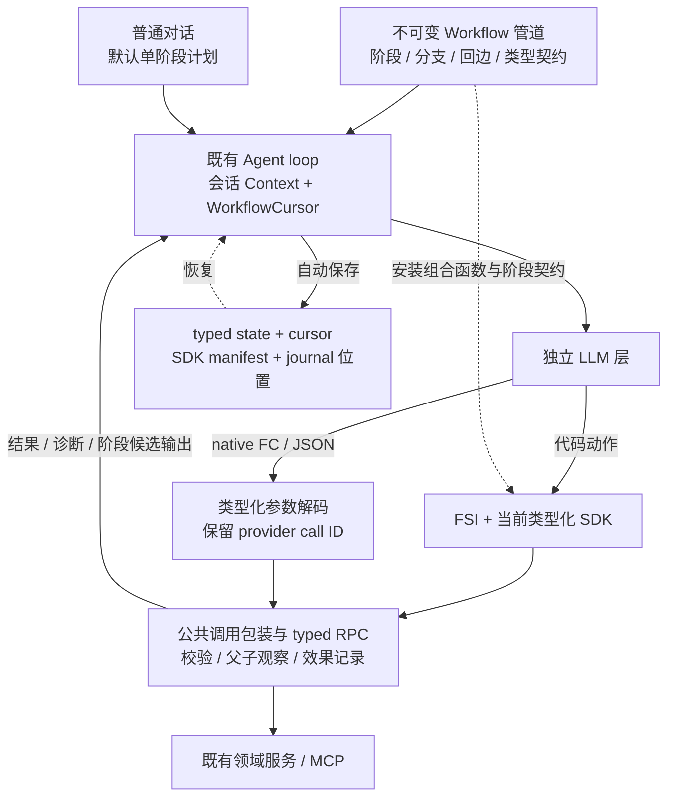

# Agent 工作流与 FSI SDK 统一计划

状态：混合方案的核心改造已实施，2026-10-08。依据对照实验保留 native FC，并与真实 FSI SDK、不可变管道及自动检查点统一。文末记录本次实现和仍未交付的工程边界；验收要求继续作为后续扩展的约束。

## 目标与决定

保留截图所示的冷、类型化、不可变 pipeline：`workflow { step ... } |> Workflow.define`。Workflow 是同一个 Agent loop 的控制计划；顺序、分支、有界回边和等待改变该 loop 的控制位置。作者不另写 Agent 驱动循环，不手动保存或加载检查点，不需要通过 `Fsi.call` 编排工具执行。

工具语义统一为同一个类型化 F# SDK，既有 native FC 与 FSI code action 都作为其调用投影保留。native JSON 参数解码为 typed invocation，FSI 代码调用实际 SDK 函数；两者使用同一函数定义、静态绑定、验证、效果执行和记录路径。Code 模式仍只需一个 FSI 代码入口，但这不意味着删除 native FC。

Workflow 声明阶段目标、输入输出契约、可组合 SDK 扩展及完成验证。运行时安装实际函数、提供类型声明、执行代码或 typed invocation、观察底层能力调用，自动保存流经管道的状态和控制位置。

统一意味着共享会话、历史、控制转移与效果执行。LLM 继续作为独立基础层，OCR 队列继续独立。内部仍区分管道、Agent 决策和领域能力的职责。



## 2026-10-08 模型实验对实施计划的约束

本机已经实现真实 `AgentCore.chatStep` + FSharp.Compiler.Service 的隔离原型，并进行 native/FSI 对照。方法、原始轨迹和最终结果见 [实验报告](native-fsi-experiment-results.md)。实验采用同一 SDK 实现，包括 Domain DU、带载荷读取 DU、写入目标预绑定和底层原语记录，不把模型口述或外层 FSI 成功当作执行证据。

保留 native FC 作为可选投影；普通对话和 Workflow 共用 SDK 与 driver。进一步区分两项决定：是否开放 SDK 的逐个 native 工具，以及代码动作采用 native JSON、native freeform 或文本代码块承载。只有一个 FSI JSON 入口并不等于 provider 协议中没有 native FC。代码承载格式作为适配器契约，不能从单次工具呈现偏好直接推导删除全部 native 协议。

实验已经暴露了 F# 类型无法覆盖的错误：编译成功后仍可能错误处理内容转义、重试已完成原语、在没有调用 SDK 时宣称完成，或者用 try/with 捕获底层失败，让外层代码执行看起来成功。P0/P1 必须先证明这些观察与验证边界；不能把任意可编译 F# 函数直接当作具备可恢复语义的工具。

据此调整实施优先级：

1. **P0 增加执行证据原型**：类型化 Validation/Retryable/Conflict 错误与 receipt；一段代码内多次成功/失败的 SDK 原语逐次记录；异常被用户代码捕获不消除原语失败；阶段完成必须通过实际输出和 receipt 验证。加入“模型宣称成功但没有执行”“前一页成功、后一页拒绝后重试”的验收。
2. **P1 同时提供组合工具的两种投影**：工作流把确定性的工具组合编译成实际 SDK 函数，bind 固定域/文档/阶段参数，导出一次能力定义。native 与 FSI 调同一个组合函数，减少模型靠选择入口自行发明批处理的负担。固定内容或格式能由宿主确定时，绑定或用构造器生成，而不是要求模型多层转义。
3. **P1 增加代码动作承载测试**：保留真实 provider call IDs；文本代码块仅执行明确的块，不执行普通说明文字；错误的块边界可观察；支持 native freeform 的 provider 单独验证，不假定所有 provider 均支持。暂不把本次文本标签实验推广成最佳代码协议。
4. **P2 先接阶段退出验证**：普通聊天与管道仍由既有 loop 驱动；仅文本声称完成不能推进 WorkflowCursor。无法验证的输出进入同一修复路径，不能悄悄当作成功检查点。
5. **P3 以底层 receipt 恢复**：阶段中一段 FSI 代码部分成功时，保存已完成原语及输入身份；恢复不可重放整个代码片段。已知提交不再产生第二次领域效果；Unknown 必须先核对。模型不负责记忆哪些页面已经提交。
6. **阶段能力策略按模型实测**：简单操作允许 native 快速路径，组合、筛选、分支保留 FSI；特定阶段可只开放高层组合工具或代码入口。先满足正确完成，再比较同任务的模型往返与成功样本耗时。模型强弱、提示样例与 API 承载格式需要分开评测。

组合工具的“一个外层调用”仍保留其所有子操作的观察、验证与持久化边界。如果组合中包含模型步骤，工具应提交或安装由共同 driver 推进的子计划，不在函数内部另开模型驱动循环。函数式管道和自动检查点的主设计保持。

时间验收拆分冷初始化、模型请求、SDK 执行、F# 检查/执行与端到端耗时；比较外层动作时同时报告底层原语数。编译/绑定缓存、短结果输出和 stage-specific SDK 呈现可作为后续优化，但分别验证，不能预先宣称一定减少模型操作步数。

## 调研结论与采用范围

调研覆盖类型化工作流、函数式事件循环、节点检查点、效果日志、程序化工具调用、动态函数安装及 F# 序列化。下表的事实来自一手文档；采用范围是针对 Patchouli 的设计判断，不是上游项目的保证。

| 对象 | 已核实的机制或限制 | 本计划采用的部分 |
| --- | --- | --- |
| [Agent.NET](https://github.com/JordanMarr/Agent.NET) | 类型化 `step` 管道；durable 模式保存阶段状态；quotation 提取函数元数据。其 README 仍列出 F# DU 检查点序列化问题。 | 保留作者语法与函数元数据思路；不直接引入其 Agent/MAF 运行时，也不假定任意 F# 类型自动可恢复。 |
| [Microsoft Agent Framework](https://learn.microsoft.com/en-us/agent-framework/workflows/checkpoints) | superstep 边界保存状态、待处理消息和请求；恢复需要匹配拓扑与 executor 身份；自定义 executor 状态需要保存/恢复钩子。 | 保存数据加控制位置；冻结执行计划；由我们的类型化包装自动提供钩子。 |
| [LangGraph checkpointers](https://docs.langchain.com/oss/python/langgraph/checkpointers) | 检查点包含 state 与 next；成功节点的 pending writes 可以在相邻节点失败后复用；sync 模式先保存再推进。 | 自动保存节点输入输出和下一位置；阶段内另保留效果日志；默认先持久化再推进。 |
| [Elmish](https://elmish.github.io/elmish/docs/basics.html) | 纯 update 根据消息和旧模型生成新模型与命令，由运行时执行命令。 | 延续现有 `Context -> Event -> Context * Effect list`，在同一纯更新中推进工作流游标。 |
| [DeepSeek Harness PTC](https://github.com/deepseek-ai/deepseek-harness/blob/master/packages/core/tools/README.md) | 支持 native、ptc 和 both；PTC 的 SDK 内部调用仍走宿主执行管线并关联子调用；其中间值不是可恢复 REPL 状态。 | 多种协议投影统一到同一工具执行；不把整段代码成功/失败当作唯一执行记录。 |
| [Cloudflare durable Code Mode](https://developers.cloudflare.com/agents/tools/codemode/durable-runtime/) | 暂停后通过回放复用已完成调用结果；拒绝不自动撤销先前动作；补偿需要 connector 的实现。 | 区分恢复、重试和补偿；可组合函数保留底层调用边界。 |
| [Temporal](https://docs.temporal.io/workflow-definition) | 回放要求一致的命令序列；LLM、数据库和外部请求等非确定性工作在被记录的活动中执行。 | 固定代码与依赖版本；只重建纯控制计划，复用已记录非确定性结果。 |
| [Restate durable steps](https://docs.restate.dev/develop/ts/durable-steps) | durable step 保存非确定性操作结果；时间和随机值有可回放的专用入口。 | 将非确定性值和原语结果纳入日志；不因函数有类型就默认确定性。 |
| [FSharp.Compiler.Service](https://fsharp.github.io/fsharp-compiler-docs/reference/fsharp-compiler-interactive-shell-fsievaluationsession.html) | `EvalInteraction` 添加定义，`AddBoundValue` 绑定值，`ParseAndCheckInteraction` 在当前 FSI 上下文中检查片段。 | 实际安装函数与输入绑定；执行前类型检查；收集准确的编译诊断。 |
| [FSharp.SystemTextJson](https://github.com/Tarmil/FSharp.SystemTextJson/blob/master/docs/Customizing.md) | 支持 record、DU、tuple、list、set 等，并允许选择 union/option 编码。 | 调研为 codec 实现候选；冻结编码契约，单独验证领域包装类型和 schema 演进。 |
| [Semantic Kernel filters](https://devblogs.microsoft.com/agent-framework/filters-in-semantic-kernel/) | 函数调用可通过统一 invocation filter 包装。 | 工具验证、观察和执行由一个公共包装器完成；不新增自动 Agent loop。 |
| [smolagents tools](https://huggingface.co/docs/smolagents/reference/tools) | 函数类型提示与文档可生成工具定义，但文档明确指出其 output schema 并不实际验证输出。 | 一份类型定义派生声明与 codec，但必须真正执行结果验证。 |

结论：不可变类型管道、共享事件循环、可观察 SDK 和自动检查点可以组合成立。没有一个上述库同时提供 Patchouli 所需的完整保证；应复用现有核心并借鉴机制，不叠加第二套 Agent 引擎。

## 当前实现与需要改动的部分

- `src/Patchouli.Workflows/Harness.fs` 已有类型化 `Workflow<'Input,'Output>`、`ChatAgent<'Input,'Output>`、`ControlShape` 和冷构建。保留这些优势及 pipeline 作者体验。
- `src/Patchouli.Workflows/WorkflowExecutor.fs` 的 `HarnessRuntime.episode` 目前另有驱动函数，`RunAsync` 从初始状态和效果日志重建运行。现有日志不是阶段类型状态加游标的直接恢复格式。
- `AgentSessionService` 已拥有共同 driver 锁、取消生命周期和会话持久化；`AgentSessionService.Harness.cs` 将 Workflow 状态发布到同一会话。以此为单一所有权基础。
- `AgentNativeTools` 当前公开多个 native tools；FSI worker 当前主要绑定 `workingDirectory`。提示中的 F# 参数声明不是已经安装的 SDK 函数。
- `AgentNativeTools.BuildInstructions` 已从 native schema 生成 F# record 与 `ToolCall` DU，但 `FSharpType` 只表达 string/int64/bool/array，`ToolProtocol.ToolValueType` 也只有基础类型和数组。当前 DTO 中的 URI、域和某些有限选项仍是 string，不能自动得到语义约束。
- `AgentFsiProcess` 在取消时终止进程，REPL 绑定随之消失；不能把这些绑定当作 durable state。
- `ScriptHostSession` 已使用 FSharp.Compiler.Service，并提供绑定宿主值的能力。应扩展已有设施，不重新建设脚本运行时。

## Workflow 契约

### 作者 API

继续导出冷 `AgentWorkflow` 值。保留 `step`、纯 `map`、`choose`、有界 `repeatUntil` 和 `awaitEvent`。这些是控制图组合器，不是脚本自行执行的循环。

阶段契约包含稳定身份、输入输出类型及 codec、纯目标格式化、SDK 模块集合和输入/输出验证。已有预算与修复上限继续由宿主执行，不再新增一套预算框架。

以下为目标 API 示意，名称尚需在实现阶段确定，代码不代表现有接口：

```fsharp
#load "translation-tools.fsx"
open Patchouli.Workflows.Scripting

let translationSdk =
    Sdk.define "Translation"
        [ Tool.export <@ TranslationTools.readWindow @>
          Tool.export <@ TranslationTools.commitPage @>
          Tool.export <@ TranslationTools.inspectReceipt @> ]

let translatePage =
    Agent.stage<TranslationState, TranslationState>
        "translate-page"
        "Translate only the current page, commit it, then submit the next typed state."
        TranslationState.goal
    |> Agent.withSdk translationSdk
    |> Agent.verifyOutput TranslationState.validateAdvance

let run : AgentWorkflow =
    workflow {
        step discover
        step (Workflow.repeatUntil 1024 TranslationState.isFinished translatePage)
        step summarize
    }
    |> Workflow.define
```

`discover` 和 `summarize` 也是类型化阶段，定义方式相同。没有 `Fsi.call`、`checkpoint`、`restoreOrCreate` 或递归的 Agent 驱动函数。原有截图中的管道结构继续成立。

### 输出进入下一阶段

模型可以在 FSI 中构造真正的 `'Output`，通过 SDK 的阶段结果提交函数交给宿主，例如 `Stage.complete nextState`。宿主检查当前阶段的准确输出类型、codec、领域不变量和执行证据，然后产生阶段完成事件。

阶段结果提交本身也属于同一 SDK 契约：Native 模式可通过其 native 投影提交符合当前 `'Output` schema 的 JSON，解码为同一候选值并进行同一验证。因此，类型化 Workflow 不强制 native 模型先执行任意 FSI 代码。文本输出阶段仍可以接收普通回答；类型化状态阶段需要满足其实际输出契约。

这样，模型不必把类型化状态先写成 prose/JSON，再由脚本业务 parser 猜测其含义。JSON 可以作为进程通信和持久化编码，但不再要求模型手工制造调用 envelope。

`Stage.complete` 只提交候选结果，不直接重入 Agent loop，也不在代码尚未结束时启动下一阶段。当前代码执行结算后，由同一 loop 验证、保存并推进。

不能仅检查模型传入了一个 `CommitReceipt` record；验证应关联宿主记录的本次提交、目标页面和阶段身份。运行时把观察到的事实与候选状态核对，避免“类型正确但没有执行”的假完成。

普通聊天使用同一控制机制的单阶段默认计划，其输出为回答文本，完成后进入 Idle。Workflow 在当前阶段完成后按控制图自动进入下一阶段；整个 Workflow 完成也不删除或关闭会话。

### 统一 loop

`AgentCore` 保持纯决策。增加工作流控制状态与相关事件，让同一轮纯更新决定当前阶段、下一目标和下一效果。将当前 Workflow 专用的阶段 drive 收敛进共同驱动路径。

概念上的运行状态由四部分组成：

1. 会话 Context 与当前阶段的模型/代码执行状态。
2. WorkflowCursor：节点身份、嵌套路径、回边迭代位置、等待标识和当前阶段输入。
3. 当前 SDK manifest 及类型化绑定版本。
4. durable journal 的已提交位置与尚未结算的效果。

`repeatUntil` 检查纯退出谓词：满足则前进，否则 cursor 回到 body，增加迭代位置。没有第二个模型驱动器。达到现有上限时明确退出，不将其当作完成。

纯 `map` 等控制转移可以在一次事件处理内执行，但必须具有停止界限，避免无模型调用的控制回边占满事件循环。

## SDK 契约

### Native FC 与 FSI 的统一

`Tool<'Input,'Output>` 是唯一的工具语义定义。它派生两种模型表面：native function name + JSON Schema，以及 FSI 中的具名 F# 函数 + 类型声明。既有 native FC 不再通过独立业务 handler 实现同一功能，而是解码到同一个 SDK invoker；SDK 原语继续调用既有领域服务。

统一不要求把 JSON 参数拼成一段 F# 源码。native adapter 按工具契约检查和解码参数，取得已验证的 typed value，绑定到登记函数并调用。若使用 FSI worker 执行具名函数，使用结构化调用协议与数据 binding，不把参数插入可执行字符串。

同一工具在两种表面下拥有相同的参数值域、已绑定上下文、canonical output、错误分类、观察事件、operation identity 和提交语义。native 的 provider call ID 与 FSI 的外层/内部调用 ID 是传输关联身份；不能因为两次调用参数相同就把它们视为同一个业务操作。

native 响应继续保留工具结果配对、错误标记和既有 provider 元数据。多个 native 调用仍按当前结算规则完成后才进入下一模型请求。FSI 组合函数的预算和观察计算到底层 SDK 调用，而不是仅把整段代码算成一次操作。

工具表面可表示为 Native、Code 或 Both；这是模型呈现选择，不是三套执行器。首轮实现先保证现有 native 工具与新 FSI SDK 一致，不新增必要性不明的自动切换机制。运行记录保存投影版本和绑定版本，恢复按记录的契约处理历史调用。

受支持的 DU 从同一个 codec 派生 native schema：无字段 DU 可映射为 enum，有字段 DU 使用明确的 case tag 与 payload。provider schema 子集不足时采用可验证的 case 分拆或兼容投影；不能静默退化为任意 string 并放弃真实解码验证。

普通对话与工作流默认具备 FSI 能力，首次调用时惰性启动独立进程；对话框不再提供启闭开关。native 调用与 FSI SDK 调用仍遵守已有宿主权限矩阵，任意 FSI/.NET 代码仍处于可信执行边界。外部 MCP/CLI 的既有 JSON 与 URI wire 契约保持，通过边界适配进入同一领域实现。

### 从 DTO 到语义类型

既有 DTO 可以提供字段形状、基础类型和编码名称；string 字段本身不能告诉生成器它是有限域、URI、筛选键还是自由文本。类型生成要结合既有领域枚举和权威资源目录，引入必要的语义类型，不从 prose 或命名猜测合法值。

内置 Agent 可直接使用 Library 专有类型，这是它相对通用 MCP 客户端的优势。示意：

```fsharp
[<RequireQualifiedAccess>]
type LibraryDomain =
    | Items | Texts | Translations | CslStyles | Runs | Workflows

[<RequireQualifiedAccess>]
type BrowseScope =
    | Root
    | Domain of LibraryDomain
    | DocumentTexts of DocumentInstanceId

[<RequireQualifiedAccess>]
type WritableResource =
    | ItemBibliography of ItemId
    | CslStyle of CslStyleId
    | TranslationPage of DocumentInstanceId * PageIndex
```

这是类型设计示意，不是完整 SDK。`library.toon` 是单例资源，Root 是发现范围，不将它们与六个目录域混为同一种资源。读取、写入和引用分别有自己的目标类型；`WritableResource` 不提供 TextPage 或 RunStatus 分支，使不支持的写入目标在受支持接口内无法构造。

动态 ID、页面索引、版本化证据和筛选值通过已有领域类型或 smart constructor 验证。wire 边界集中进行 typed resource 与 `patchouli://` URI 的编码/解码，模型通常不再自行拼路径。编码需要与真实资源解析器一致，包括修订、box 和转义规则；资源是否存在与是否获授权仍由宿主检查。

模型提示直接包含当前可用的 DU cases、record、函数签名、构造方式与必要示例。它既是可编译契约，也是选择空间的说明；native 模式也可以阅读同一份 F# 类型声明，同时使用明确示例说明对应 JSON 编码。

优先收窄的项目包括：Library 域、可读/可写资源、固定格式/明细选项、已有闭集状态、控制指令和域相关筛选。类型来自同一目录与 DTO/领域契约；不要各维护一个 JSON enum、F# DU 与路径白名单。

### 参数静态绑定与特化

页面选择、目标资源、语言、窗口规则、输出格式等已由阶段输入确定的参数，由 Workflow 绑定到工具描述值和 worker 的 typed environment。模型只提供真正未知的参数。

例如，通用提交工具可接受 `target + content`；当前页面阶段将 target 固定后，对模型公开：

```fsharp
val commitCurrentPage:
    Markdown -> Task<Result<CommitReceipt, ToolError>>
```

模型不用重复选择 document、page 或 URI。native 投影也只公开 content，调用同一个特化函数；已绑定 target 不出现在模型可覆盖的 JSON 参数里。绑定仍在运行时核验，不能让附加 JSON 字段改变它。

`Tool.bind`/特化需要产出新的不可变描述值，保存函数版本、绑定类型与 payload、绑定 hash 和模型可见签名。不同页面通过不同 activation 上下文绑定，即使函数名和模型参数 schema 相同，也不能错误复用上一页的结果。

只捕获可验证、可序列化、可重建的数据。宿主服务对象、句柄、Task 和任意 closure 不属于可静态保存参数；服务能力通过 worker 内的 typed proxy 取得。语言等参数固定是否合适由阶段契约决定，用户新消息要求修改时先更新和验证契约，再发布新绑定。

### 函数与工具描述值

工具实现尽量使用普通 F# 函数。纯函数返回普通数据；调用宿主能力的函数使用统一的 `Task<Result<'Output, ToolError>>` 等受支持签名。`Tool<'Input,'Output>` 是冷、不可变的描述值，引用稳定的函数定义并携带类型、codec、验证和观察信息。

MVP 不要求把所有函数重写成另一套工具 DSL。普通函数组合和现有 SDK 原语即可表达顺序、批处理和局部条件。`Tool.compose`、`map`、输入适配及验证装饰器可在同一 typed descriptor 上提供，类型不匹配由编译器拒绝。

所有注册工具调用都经过公共包装器，产生 input/start/result/error 记录。组合工具调用包含父子关联；底层宿主原语也独立记录。不能仅记录组合函数最外层结果。

仅经过包装器和 SDK 原语的效果享有观察与恢复保证。可信函数自行执行的任意 .NET IO 不能靠反射或 F# 类型系统自动截获，不暗示可恢复。类型化可组合接口应引导作者使用现有领域能力，而不是直接 SQL 或另一套 Library 实现。

### 一份类型定义，多个投影

受支持的语义 F# 类型、函数定义和静态绑定共同派生：实际 SDK 函数签名、模型看到的声明与文档、native FC JSON Schema 与 codec、进程数据 codec、durable state schema 和验证入口。既有 DTO 的基础形状通过边界投影复用；避免手工维护互不一致的 JSON Schema、F# 参数类型与实现签名。

编译器验证结构与类型衔接；smart constructor、显式 validator 和宿主检查验证值域与业务事实。私有包装类型的解码必须经过其验证入口，不能由通用反射反序列化绕过构造约束。

FSI 执行前在当前 SDK 上下文中检查模型代码；出现未知符号、参数类型错误或输出类型错误时不执行该片段，并把具体诊断送回同一个 Agent 修复路径。检查与执行串行化，避免安装 SDK 后类型检查上下文与执行上下文发生偏移。

### 实时安装

阶段激活时安装其依赖模块与函数，绑定不可变阶段输入。manifest 记录模块源码/产物 hash、导出符号、精确类型契约、依赖版本与绑定 schema。

quotation 可用于从具名函数提取身份和类型，但不是跨进程 closure 序列化器。FSI 在独立进程内运行，不能把宿主内存中的任意 lambda 或服务对象直接搬过去。实现采用源码/编译产物支持的具名模块、共享契约程序集和 typed RPC binding。

同名类型在不同动态程序集里不必是同一 .NET Type。基础契约共享固定程序集；工作流自定义类型与函数使用同一冻结源码包生成的确定产物，host 和 worker 引用匹配产物，并通过 schema 验证跨进程数据。不得仅比较类型名称。

注册只发布完成类型检查、依赖检查与安装的完整 manifest。安装失败不改变宿主当前 SDK 版本；FSI 若发生部分定义污染则重建 worker 后加载已提交版本。

SDK 使用版本化模块身份，避免静默 shadow 旧函数。阶段切换时模型收到当前可用声明；宿主原语校验实际当前阶段上下文，不能靠模型看到的 allowlist 充当权限执行。

普通 REPL 的临时变量不自动成为 durable state。需要重启后复用的模型生成函数，通过显式 SDK 注册保存可重建的定义与依赖；任意 closure、运行中 Task 和外部句柄不进入 manifest。

### 与历史缓存一致

Code 模式的 wire 保留固定 FSI 代码执行入口；Native/Both 模式使用同一 SDK 派生的 native declarations。基础 SDK 声明稳定；阶段新增声明与契约作为追加上下文进入当前历史。

native 特化尽量保持函数名与参数 schema 在当前运行内稳定：页面和目标等绑定值保存在 activation/manifest 中，而不是每页改写 schema。需要不同工具集合时，优先冻结运行级 declarations 并由当前阶段宿主契约控制可调用范围；不能声称任意修改 native schema 仍能保持相同缓存前缀。实际 SDK/schema 变更必须有记录的版本与指纹，恢复核对，不改写历史请求。

SDK manifest 是恢复事实，不能仅依赖模型上下文里是否还有文档。上下文压缩后需要时重发当前声明；压缩方案、原始历史和历史查询能力继续遵循 ADR 0040。历史查询也成为 FSI SDK 函数。

## 自动检查点与恢复

### 保存内容

每个 checkpoint 保存：plan 与依赖 hash、节点和回边位置、输入/输出 schema 身份、不可变 typed state payload、会话/模型上下文的 journal 位置、SDK manifest 版本、等待状态，以及效果日志的提交位置。大历史和大文本通过已有日志或内容寻址引用保存，不在每个检查点复制一份。

自动保存至少覆盖：初始输入、阶段进入、验证通过的阶段退出、纯状态/路由转移、每次回边、事件等待和明确的停止/取消边界。阶段内部继续记录模型结果与 SDK 原语结果，使多次模型调用的阶段也能恢复。

只有验证通过且 checkpoint 持久化成功，才能向下一阶段发布输出并推进游标。持久化失败保留原位置，不能继续执行下一阶段。

不可变运行时值仍可以共享内存；persisted state 要使用明确的 codec。支持范围先覆盖受验证的 record、DU、tuple、list、option、map 等；拒绝函数、任意 obj、可变集合、Task、句柄和无法重建的对象图。F# record 的不可变字段不意味着其字段指向的对象也不可变。

### 从节点恢复，不保存 continuation

冷计划根据冻结的脚本和依赖重建。cursor 定位当前节点，匹配的 typed codec 恢复该节点输入，已完成节点输出直接复用。循环位置使用可序列化 frame，F# continuation 和闭包留在可重建计划中，不序列化到磁盘。

恢复检查 plan hash、节点身份、schema 和 SDK manifest；不匹配时在任何新效果之前明确失败。正常恢复不重新调用已完成阶段的模型，也不重新执行已结算写入。

FSI 重建只加载受管理定义和保存的数据绑定。不能重放整段历史代码来“找回变量”，因为其中可能包含先前写入。未注册的临时绑定丢失时，要给模型准确诊断并允许它通过保存的数据重新建立，而不是伪装成绑定仍存在。

### 效果结算与部分成功

SDK 原语日志至少包含 operation identity、父子调用身份、调用投影、定义版本、绑定版本、动态输入、状态和 canonical 结果引用。失败结果也记录；已完成原语的结果可复用，未完成原语按读/写性质处理。native 与 FSI 的恢复均通过同一日志和定义契约。

registered 组合函数若需要在内部恢复，可以在冻结实现与确定性控制假设下重新执行纯部分，并用日志匹配已完成原语及返回记录结果。若调用序列、定义或参数不匹配则失败。原始任意 FSI 代码不会默认采用这种回放。

Library 写入需要稳定的业务 operation identity 与可查询的提交 receipt。原语已经完成但 journal 尚未持久化的崩溃窗口，不能靠 checkpoint 消除：在领域事务内保存可核对的 operation receipt，或采用明确的等价结果核对；恢复先查询再决定。

未支持幂等或结果查询的外部写入进入 Unknown，不能默认自动重试。一个组合函数中途失败不撤销先前已提交操作。自动 checkpoint 不等于事务回滚，也不保证任意 .NET IO exactly-once。

### 用户消息与会话生命周期

driver 所有权继续在 AgentSessionService。每个效果边界处理 inbox；用户消息影响同一会话和当前阶段，已经完成的结果保留。未验证的候选输出不能推进管道。改变任务选择或目标时，必须明确重验证阶段契约，而不是悄悄改变已记录输入。

同步检查点继续属于辅助 Session 数据；新设备收到数据不获得执行所有权；本地 FSI worker 在实际执行时创建。恢复被已有权限状态阻止时保留检查点，返回明确原因，不自动扩大授权。

## 观察与验证

统一记录 StageEntered、ModelRequested、CodeChecked、SdkCallStarted/Completed/Failed、OutputValidated/Rejected、CheckpointCommitted、RouteTaken、Awaiting 和 Session 状态转移等语义事件。具体名字在实现时与现有日志契约协调，不再维护一套重复的 UI 状态。

UI 的阶段进度、错误和输入输出展开来自真实事件；模型只收到必要的结果和诊断，完整的原语结果仍可在宿主日志查询。工具调用显示父子结构，让“一个 FSI 调用做了多件事”可检查。

验证分三层：

1. 编译检查：节点输入输出衔接、导出函数签名、模型代码类型。
2. 数据验证：值域、schema、领域包装类型和输入输出不变量。
3. 执行证据验证：实际读取/提交结果与候选阶段输出一致。

这些验证不证明翻译正确或任意函数终止；F# 类型系统也不是 .NET 权限沙箱。现有可信脚本与 FSI/.NET 信任边界继续成立，不新增审批界面或权限框架。

## 实施顺序与验收

| 阶段 | 交付 | 必须通过的验收 |
| --- | --- | --- |
| P0 契约原型 | 冻结 WorkflowCursor、阶段输出、Tool/SDK descriptor、state codec 和 manifest 设计；验证 host/FSI 类型身份、领域 DU 和参数特化 | 自定义 record/DU 和 private wrapper 在 host、worker、native JSON、重启后往返；不匹配阶段编译失败；函数捕获和不支持的持久类型明确拒绝；错误域和非法写入目标被拒绝。 |
| P1 类型化 SDK | 既有领域能力的 F# binding、函数导出、组合、安装、参数静态绑定、native/FSI 两种投影及公共验证和父子观察 | 两种投影取得相同 canonical 结果/错误/receipt；同一特化工具不能覆盖绑定；多个原语组合后仍有各自记录；部分失败可核对；native ID 配对与 provider metadata 保留；安装失败不发布新 SDK。 |
| P2 单一驱动 | 同一个 AgentCore/host driver 推进聊天及 WorkflowCursor；移除 Workflow 专用 model drive | 聊天与管道使用同一 Context；分支与 repeatUntil 流向正确；消息、取消、模型修复和 tool 修复保持现有语义；没有并行夺取 driver 的第二个 loop。 |
| P3 自动恢复 | 类型化节点检查点、阶段内效果日志、SDK 重建、operation receipt 核对 | 在节点进入/完成、原语开始/提交、日志保存/检查点保存处注入崩溃；已结算模型不重采样；已提交页面不重复写；Unknown 不盲目重试；已完成节点不从头重跑。 |
| P4 内置工作流 | 全文翻译继续采用 discover → 有界页面处理 → summarize；通过可组合 SDK 收集真实输出 | 全选择范围无遗漏无重复；结构不匹配可修复；输出依据 receipts；FSI worker 重启后继续剩余页面；脚本中没有手工 checkpoint 或 Agent 驱动循环。 |
| P5 契约切换 | 更新 ADR、workflow-api、CONTEXT 与必要的 MCP/Session 格式说明；把既有 native FC 迁移到公共 SDK invoker，清理重复 schema/handler 与适配逻辑 | 外部 MCP 与 CLI 契约保持；现有 native 能力及授权语义保持；历史仍可读；不兼容恢复材料明确拒绝而非默默重跑；不增加旧引擎兼容分支；UI/同步/物理清除测试通过。 |

P0 先解决稳定类型产物、真实 SDK 注入、native/FSI 同义调用、语义类型/参数特化、阶段 typed output 和自动恢复位置。它是一次小型实现验证，不是引入整个第三方运行时。

测试除上述场景外，还需要：纯组合的值语义一致性、观察包装不改变 canonical 结果、codec 往返和错误 schema、native DU discriminator/payload 验证、静态绑定覆盖拒绝、URI 双向转换、两种投影的修复/取消/部分提交一致性、回边最大次数、代码前置检查阻止实际效果、source/SDK 漂移、并发 resume 和 stop/commit 竞态。真实模型试验比较任务完成率、编译修复次数、运行错误、延迟与 token，并单独比较自由 string、DU 提示与静态特化三种接口的目标选择错误，不用 wire 格式成功率替代任务成功率。

实现非文档改动时先运行仓库 `scripts/cleanup-code.ps1` 再测试；非文档提交前运行 `scripts/inspect-code.ps1`，使用仓库指定的 JetBrains CLT 2026.1.4。设计文档本身不需要运行生产测试。

## ADR 关系与范围

- 延续 ADR 0039 的冷、类型化 pipeline、单一 AgentCore、宿主所有权、有限预算和类型衔接；修订工具语义与呈现分离、类型化阶段输出及主要依赖效果回放恢复阶段状态的部分。保留 native FC，统一其 SDK 实现而非删除这种协议。
- 修订 ADR 0038 的“只有进程内 REPL 绑定、重启不重建”部分：仅受管理 SDK 定义和显式类型化绑定可重建，任意临时状态仍不承诺恢复。保留独立进程与 workspace；2026-10-09 起普通对话与工作流默认具备 FSI 能力，不再使用会话 grant。
- 延续 ADR 0040 的原始历史、整前缀压缩和稳定 wire 前缀，不引入每页新会话、独立 evaluator 或新的预算/权限框架。
- 保留 ADR 0034 的 Page Translation 存储与结构验证、ADR 0036 的 Session/Workflow 同步与所有权以及 OCR 独立性。

2026-10-08 实施记录：已按混合方案接入共享 SDK invoker、真实独立 FSI RPC、可组合/静态绑定工具、原语回执、共享 AgentDriver、节点与路由检查点和回执驱动的内置翻译；当前契约见 [workflow-api](workflow-api.md)，API 升至 `/5`。

本次采用显式 wire codec + 生成 F# DTO binding，在宿主重建真实类型，避免跨动态 FSI 程序集进行 CLR cast。基础语义 DU 来自固定 Agent 程序集。工作流自定义函数在宿主执行，worker 的具名函数经 typed RPC 调用它；任意 closure 不作为状态持久化。定义和绑定由冻结脚本及节点输入重建，身份包含脚本、运行时、codec 和绑定 hash。外部 `#load/#r` 尚未打包，运行时明确拒绝，不声称已实现确定性自定义程序集打包。

仍保留的工程边界：尚无领域事务内业务幂等 receipt、自动未知写入核对和专用核对 UI；Unknown 会隔离该会话中的目标写入。检查点当前保存完整 core context，未做内容寻址的历史去重。对任意 .NET IO 不提供恢复/回滚保证。以后扩展这些能力应沿上述验收要求推进，而不是弱化现有拒绝重复写入的行为。

### 2026-10-09 验证结果

- 最终 `Patchouli.Tests` 项目构建：0 warning / 0 error。
- 核心恢复与 SDK 组：23/23 通过，覆盖真实 FSI RPC、参数静态绑定、原语预算、捕获异常仍留回执、未 await Task 的结算、过期 Task 的隔离、未知写入失败、节点/路由恢复及 provider 失败后继续对话。
- 扩大回归覆盖 Agent、Workflow、provider 适配及 MCP 会话指令，共 284 项；首次 282 通过。旧自动恢复用例要求重试未知写入，现已改为拒绝且在最终核心组通过。另一项 Avalonia dispatcher 隔离失败单独复跑通过，不将首次扩大回归描述为全绿。
- SDK 子操作 UI 测试通过：按 operation ID 合并开始/结束，保留 parent ID、输入、错误和耗时，不覆盖外层 FSI 活动。
- 所有改动代码按仓库要求运行 JetBrains 2026.1.4 cleanup；本次 C# 改动范围 InspectCode 的阻塞项为 0。全仓库检查仍有其他范围的 XAML 和测试闭包等阻塞，未提交 Git commit。
- 本轮验证不调用付费模型 API。临时构建、测试结果及检查日志均位于统一的 `.tmp/`；新增测试遵循共享 RepositoryTestEnvironment。
