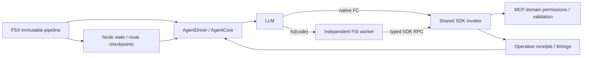

# F# agent workflow API

The workflow controls the Patchouli agent. Its entry point is a cold `AgentWorkflow` value. See [ADR 0039](adr/0039-typed-functional-agent-harness-workflows.md).

## Workflow declarations and editor configuration

A workflow declares independent module-level `let Parameter<'T>` bindings with SDK constructors.
The script also exports `info` through `WorkflowInfo`, and binds its model parameter to the root
with `Workflow.withModel`. Stable parameter keys, display labels, control types, defaults,
constraints and context bindings come from these declarations, not external JSON metadata.
See [ADR 0042](adr/0042-statically-declared-workflow-parameters.md).

```fsharp
open Patchouli.Workflows
open Patchouli.Workflows.Scripting

let info =
    WorkflowInfo.create "Research" "Research the selected documents."
    |> WorkflowInfo.selectionScope WorkflowSelectionScope.DocumentsAndPages
    |> WorkflowInfo.menu "Tools/Workflows" 100

let model = Parameter.model "model" "执行模型"
let question = Parameter.text "question" "问题" "Describe the selection"
let radius = Parameter.integer "radius" "上下文半径" 1 |> Parameter.intRange 0 5

let researcher =
    Agent.text "research" "Find evidence and cite tool results."
        (fun (input: WorkflowInput) -> Parameter.get question input)
    |> Agent.withTools [ AgentTool.Find; AgentTool.Fetch; AgentTool.Cite ]

let run : AgentWorkflow =
    Agent.run researcher |> Workflow.define |> Workflow.withModel model
```

The editor statically extracts declarations without evaluating the script. Literals, static SDK
records/unions and collections, supported SDK calls/pipelines, and immutable aliases are supported;
user function calls and runtime-dependent declaration expressions produce source diagnostics.
SDK symbol identity is checked, so unrelated functions with the same name are not declarations.
All declared parameters appear in source order. `Parameter.get` returns an ordinary typed value;
its subsequent use is not restricted by declaration syntax. Model values are a provider/model
pair; credential material remains in the platform credential store.

The generated form is displayed only inside the workflow editor. Built-in script locking does
not prevent editing user configuration. Launch uses saved configuration plus declared context
bindings and defaults; explicit MCP parameters override only that run. Invalid fields prevent
session creation. Desktop launch reports the error in the status bar and opens the editor with
field errors highlighted, while preserving unsaved drafts. Correcting and saving configuration
does not automatically launch. MCP uses the same Host validation.

Version 6 introduced frozen declaration identity, resolved parameter values and the actual model selection;
version 7 retains these fields
alongside script and launch selection. Resume does not consult current defaults. Versions 6 and
older retain readable history but cannot resume through a compatibility executor.



A workflow is one automated prompt sequence inside a conversation. Ending, stopping or failing
that sequence does not close the conversation. A new user message restarts the same agent with
the existing append-only history and completed tool results, rather than replaying the workflow
from its beginning. Messages queued while automation owns the driver continue after it yields.

Provider failures are recorded as structured model diagnostics, with a visible lifecycle diagnosis. Tool
failures return to the agent for repair and also record their actual error code, full response,
original arguments and elapsed time. The chat view pairs request/result records by effect ID,
preserves expanded rows across refreshes and automatically expands failures. Legacy failed
snapshots without a terminal log row still expose their diagnostic detail.

Temporary provider, network, rate-limit and damaged provider-response decoding failures enter the
loop as structured `ModelFailure` events. They consume only the model request retry budget;
user cancellation and interruption are never automatically retried. Errors remain in the durable
history and activity journal but model request errors and retry notices are omitted from provider
input, so retries use the same model-visible request. OCR retains its independent classification.

`Context.Retry` records the maximum extra request attempts and consecutive attempts consumed.
The settings value `Llm.AgentMaxRetries` defaults to 3, accepts 0–20, and 0 disables automatic
request retries. Each new request sequence captures current settings before execution; its limit
stays frozen across retries and recovery. Success resets the count immediately, including replies
containing native tool calls. Host backoff is cancellable, starts at 2 seconds and doubles with
20% jitter up to 60 seconds. Provider Retry-After is not exposed by the transport and is not guessed.
Tool failures, argument/FSI diagnostics, allowlist refusals and typed output validation feed the
normal model loop without spending request retries. Workflow model/tool budgets still bound those
corrections. Request retries do not spend additional model-turn slots, including after the final
slot fails. `AgentBudget.ModelTurns` and `Workflow.bounds` bound normal decision turns, not all
provider requests: each sequence separately allows `AgentMaxRetries` extra requests. Activity,
request telemetry and cost accounting still retain every attempted provider request. Replay keys retain retry attempt and policy, restoring both before any live continuation.
The legacy `toolRetryLimit` launch parameter no longer overrides request retries.

Core snapshots emit `retryPolicyVersion: 2`. Legacy snapshots preserve history, call ledger and
pending native calls, reset the old shared repair count, and adopt the new default; unknown newer
policy versions fail closed. Workflow harness protocol 7 rejects automated resume of protocol 6
and older: history remains readable; start a new automated workflow run. Conversation continuation
can still use the existing history and completed results, without replaying completed tools.

Native tool instructions include F# argument record types generated from the declared schemas,
optional-field JSON encoding and native call examples. Tool and assistant-call wire messages
always include `content`, including empty assistant text.

Assistant output is a typed `AssistantReply`: text, actual model, finish kind, native tool calls
and provider metadata. It follows [pi's typed content and tool-call loop](https://github.com/badlogic/pi-mono/blob/main/packages/agent/src/agent-loop.ts).
Text never executes a tool. Native calls carry provider call IDs; every result has the matching
ID and error flag. A batch settles before another model request. The published MCP schemas
and F# `ToolValueType` / `ToolProtocolError` validate arguments before execution.

Following [DeepSeek Harness's turn lifecycle](https://github.com/deepseek-ai/deepseek-harness/blob/master/docs/agent-lifecycle.md),
a natural final reply with no native calls ends the turn, records `turn/end`, closes host activity
and persists `Idle`; the conversation can accept a new message. Truncated calls are never
executed. Interrupted calls are paired with explicit unknown/aborted outcomes before a fresh
user turn, rather than blindly replayed. Workflow snapshot protocol version 7 retains typed node checkpoints, SDK observations and the
frozen declaration identity, parameter values and model selection introduced by version 6.
Version 7 changes request-retry and replay semantics; older snapshots
require a new automated run. Original conversation history remains readable.

Provider projections reuse LlmTornado's native function interfaces. OpenAI-compatible models
retain `tool_calls`/`tool_call_id`, DeepSeek retains `reasoning_content`, Gemini retains
`thoughtSignature`, and Anthropic retains thinking content/signatures and tool error flags.
Signatures are dropped across models. Paired wire IDs are normalized deterministically,
including Mistral's nine-character constraint, while the durable transcript keeps original IDs.
The Codex subscription adapter sends native initial history and function schemas, returning
calls to the host controller without an SDK-owned tool loop. Assistant captions use each
recorded reply's actual model; historical replies use recorded model telemetry when available.

The composer handles Enter in the tunnelling key route before TextBox inserts a newline;
Shift+Enter retains native multiline editing. No shortcut caption is displayed. The composer has
one primary button: nonempty input selects send, empty input during execution selects stop,
and empty input in a resumable state selects resume. Idle empty input shows disabled send.

The activity-row presentation follows the input/output disclosure and state feedback patterns in
[DeepSeek Harness WebUI](https://github.com/deepseek-ai/deepseek-harness/tree/master/packages/client/ui-tool).
Motion includes gentle row entry, disclosure fade, hover feedback and a running-state pulse;
the conversation menu offers a reduced-motion option.

```fsharp
open Patchouli.Workflows.Scripting

let researcher =
    Agent.text "research" "Find evidence and cite tool results."
        (fun (input: WorkflowInput) -> WorkflowInput.parameter "question" "Describe the selection" input)
    |> Agent.withTools [ AgentTool.Find; AgentTool.Fetch; AgentTool.Cite ]
    |> Agent.withBudget (AgentBudget.create 12 10)

let reviewer =
    Agent.text "review" "Check the preceding answer against evidence. Return a corrected answer."
        (fun (answer: string) -> answer)
    |> Agent.withTools [ AgentTool.Fetch ]
    |> Agent.withBudget (AgentBudget.create 6 4)

let run : AgentWorkflow =
    workflow {
        step researcher
        step reviewer
    }
    |> Workflow.define
```

`Agent.typed name instructions format parse` produces a validated typed output. `parse` receives the immutable stage input and final agent text, returning `Result<'Output,string>`. Parse failure returns its diagnostic to the same agent under the stage budget without consuming request retries; stage budget exhaustion yields control. For review decisions, return a domain union such as `Accepted of Draft | Revise of Draft` as a successful typed output, then use `Workflow.choose` or immutable state with `Workflow.repeatUntil`.

`Agent.withSharedInstructions formatRules` retains the formatted rules once as a structured
instruction in the active conversation history. Stage policy instructions are also retained once;
subsequent stage prompts contain only the formatted task. Missing rules are reinserted, so a
future context compactor can discard them without a stale initialization flag suppressing recovery.
The shared host interpreter compacts the entire active prefix at 80% of the configured model
context capacity, then continues from the saved summary. Between compactions, provider history
remains append-only for inference caching. Original history stays intact; `AgentTool.History`
allows a stage to search/page its own uncompressed transcript and recover omitted details.
Replay keys use a rule fingerprint rather than repeating the full rules at every recorded effect.
See [ADR 0040](adr/0040-cache-preserving-whole-prefix-compaction.md).

The built-in full-text translator discovers a typed page plan through the agent's existing
find/fetch tools, then uses a bounded loop over immutable remaining-page state. Each page sends
only its document and page instruction and uses the same agent's fetch/put tools, window and
structure-validation rules. A statically bound `commitTranslation` takes only `{ content: string }`;
the host selects its page from immutable workflow input. The final stage summarizes actual receipt-derived outcomes. No page is translated
by a separate script-side LLM or tool implementation.

```fsharp
type Review = { Draft: string; Attempt: int; Accepted: bool }

let refine =
    Agent.typed "refine" "Review and improve the draft; reply APPROVED when satisfactory."
        (fun (state: Review) -> state.Draft)
        (fun state reply ->
            Ok { Draft = if reply = "APPROVED" then state.Draft else reply
                 Attempt = state.Attempt + 1
                 Accepted = reply = "APPROVED" })
    |> Agent.withBudget (AgentBudget.create 3 0)
    |> Agent.run

let reviewLoop = Workflow.repeatUntil 4 (fun state -> state.Accepted) refine
```

- `Workflow.map f`: pure transformation; no Task/Async overload.
- `Workflow.thenDo next previous` or `workflow { step previous; step next }`: types must connect.
- `Workflow.choose predicate yes no`: same input/output types for both arms; executes one arm.
- `Workflow.repeatUntil limit doneWhen body`: precondition loop over one immutable state type; exhaustion fails.
- `Workflow.awaitEvent uri parse`: requires `unit` input and establishes a typed event result through existing host primitives.
- `Workflow.define`: closes a flow whose input is `WorkflowInput` into the root contract.
- `Workflow.bounds run.Shape`: structural upper bounds for model turns, tool calls and event waits.
- `Agent.requireToolUse tools`: requires completed attempts of allowed tools before final prose ends a stage. Business results still need validation.
- `Agent.withSdkTools (fun input -> exports)`: installs input-bound typed functions as native tools and callable `AgentTools` FSI bindings. Names must be unique; primitive capabilities are explicit.
- `Agent.withEvidence validator`: validates actual `SdkObservation[]` before accepting the output.
- `Agent.verified name instructions format parse`: its parser receives input, operation evidence and reply text; it can derive immutable output from receipts instead of trusting prose.
- `Workflow.withCodecs inputCodec outputCodec`: explicit validated codecs for private smart-constructor types. Default reflection supports public immutable records, DUs, tuples, lists, options, sets and maps; it rejects mutable, recursive, opaque and private types.

```fsharp
open Patchouli.Agent.Sdk

let pageTools document page =
    [ LibraryTools.commitTranslation
      |> Tool.bind (WritableResource.TranslationPage(document, page))
      |> Tool.export ]

// Inside session-local FSI (the host installs these functions automatically):
let result =
    AgentTools.commitTranslation { content = "translated Markdown" }
    |> Async.AwaitTask |> Async.RunSynchronously
printfn "%s" result
```

`Tool.create`, `Tool.map`, `Tool.compose`, `Tool.bind`, `Tool.withCapabilities`, `Tool.withVersion`
and `Tool.exportWith` build immutable descriptors. Native arguments decode through the tool's
input codec before its implementation runs. Static bindings are absent from the model's schema
and included in durable identity. Primitive dependencies are callable inside the function without
exposing unrestricted primitives to the model; ordinary MCP permission checks still apply.
`Sdk.find`/`fetch`/`put` accept semantic resource DUs. `Sdk.call` provides the lossless JSON boundary
for every primitive, including history. The worker also receives callable `AgentTools.find`,
`fetch`, `put`, `cite` and `history` records generated from the declared schemas; `send` remains
available through the raw SDK boundary when explicitly permitted by the stage. Optional
native fields use `None` and are omitted on the wire. Exported option fields use their explicit codec.

The independent worker uses generated **wire DTOs**, not casts between dynamic FSI CLR types.
These DTOs preserve record/DU wire structure; exported functions return typed DTOs through
`Sdk.invoke`, while primitives return `SdkResult` with lossless domain JSON. The original host
codec validates and reconstructs the actual domain type. A shared nominal CLR identity across
processes is unnecessary. Custom codecs must publish a supported wire schema for typed bindings.

Every node records input/output schema identities, state, structural path and agent cursor under
`workflow/checkpoints.jsonl`. Saved outputs and branch/loop routes bypass completed callbacks on
restart. Plan identity includes frozen script hash and runtime assembly identities. Unmanaged
`#load`/`#r` workflow imports are refused at runtime because they are not captured by the snapshot;
keep definitions in the script or the built-in SDK. Top-level script code is still trusted code.

`sdk/*.json` records each primitive before execution and its settled outcome; `sdk/operation`
events retain parent ID, parameters, duration and errors even when F# catches an exception.
FSI tool results include these observations. Tool budgets count nested primitive attempts;
a pure FSI calculation spends no primitive budget. Compile checks precede execution of the entire block.
FSI execution markers reuse completed outcomes and refuse to replay interrupted whole code blocks.
Every admitted SDK Task settles before its evaluation returns. A Task that tries to call the SDK
after its evaluation ends receives `SDK_SCOPE_EXPIRED`; it cannot execute in the next stage's scope.
Completed writes reuse receipts. Interrupted reads may repeat; unknown writes quarantine the target
within the session, including attempts with a new effect ID. Reconcile the actual resource before
starting a fresh session. There is no automatic domain reconciliation UI in this revision, nor an
exactly-once guarantee for arbitrary .NET IO or a crash between domain commit and journal persistence.
An unknown operation fails the automated workflow before another model turn, even for a plain
`Agent.text` stage; a model's final prose cannot convert it into a successful workflow.
Damaged recovery logs fail closed rather than silently skipping records and re-executing effects.

Tools use the existing agent protocol. A stage's allowlist only narrows host permissions. FSI is available automatically in chat and workflow sessions; including `AgentTool.Fsi` allows that stage to use the session-local worker. `WorkflowInput` provides immutable lists and an F# map of recorded launch parameters.

The settings page checks the F# root type without evaluating the script. Replay checks the exact
request and structural path. Older snapshots have no automated compatibility execution path; start
a new session. Legacy imperative scripts must be rewritten; harness 6 scripts can start a new
session unchanged.

Type and bound checks establish control-flow properties assuming pure callbacks terminate. They do not prove model output correct or restrict arbitrary trusted .NET script code.
